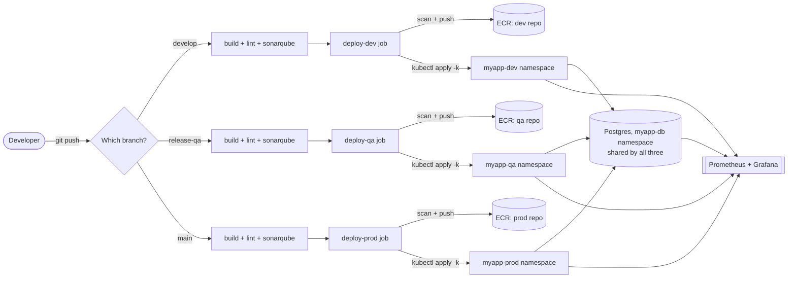

# MyApplication - Daily Journal

[](https://github.com/NaveenSagar7/eks-devops-showcase/actions/workflows/ci_cd.yaml)


A small Java/Spring Boot app deployed on Tomcat, backed by PostgreSQL,
running on AWS EKS behind an ALB - built out as a **learning reference for
what a production-grade CI/CD setup looks like in a real organization**,
across three genuinely separate environments (dev, QA, prod).

## Table of Contents

- [What the app actually does](#what-the-app-actually-does)
- [Stack](#stack)
- [Architecture](#architecture)
- [Repo layout, and why each piece exists](#repo-layout-and-why-each-piece-exists)
- [Why one shared database, not three](#why-one-shared-database-not-three)
- [How Kustomize's base/overlays work here](#how-kustomizes-baseoverlays-work-here)
- [The CI/CD pipeline, in short](#the-cicd-pipeline-in-short)
- [Prerequisites to make this actually work](#prerequisites-to-make-this-actually-work)
- [Local development](#local-development-no-kubernetes-needed)
- [Hardening notes](#hardening-notes)

---

## What the app actually does

The homepage banner asks *"Have you already been to this application?"*.
New users fill in Name / Age / DOB / PAN number, then are taken straight to
"write about today". Returning users just enter their PAN number; if it
matches an existing record they land on a dashboard with **Add a new post**
and **View my previous posts**.

PAN numbers are sensitive PII, so the app never stores the plaintext value.
It stores a keyed HMAC-SHA256 hash (used to look returning users up) and a
masked copy (`XXXXX1234F`, for display only) - see
[`PanUtil.java`](app/src/main/java/com/myapp/dailyjournal/util/PanUtil.java).
This design authenticates a returning user by PAN alone, which is
identification, not real authentication (a PAN isn't a secret) - fine for
this exercise, not something to reuse as-is for a system holding real PII.

## Stack

| Layer | Technology |
|---|---|
| Language / Framework | Java 17, Spring Boot 3 (WAR packaging), Thymeleaf, Spring Data JPA |
| Runtime | Tomcat 10.1, external via Docker (not the embedded server) |
| Database | PostgreSQL 16 - one shared StatefulSet + PVC ([why](#why-one-shared-database-not-three)) |
| Ingress | AWS ALB via `k8s/base/ingress.yaml` (needs the AWS Load Balancer Controller) |
| Code quality | Checkstyle (build-time lint gate) + SonarQube (static analysis + quality gate) |
| Security | Trivy - image vulnerability scanning, gates the push |
| Observability | kube-prometheus-stack - Prometheus alerts + a Grafana dashboard |

## Architecture



One AWS OIDC-federated IAM role per environment authenticates each deploy
job to AWS - no long-lived AWS keys stored in GitHub anywhere.

## Repo layout, and why each piece exists

```
.github/workflows/ci_cd.yaml   The entire CI/CD pipeline - see below
app/                            Spring Boot source (WAR, deployed onto Tomcat 10.1)
docker/
  Dockerfile                    Multi-stage build: maven build -> tomcat runtime.
                                 This is the ONLY thing actually used to build
                                 the image that ships to EKS.
  docker-compose.yml             Local-only convenience: runs the app + a stock
                                 postgres:16-alpine container together with plain
                                 Docker, so you can sanity-check the app works
                                 BEFORE ever touching Kubernetes. Not used by CI
                                 or EKS at all - purely a "does this even build
                                 and run" smoke test on your own machine.
  .env.example                  Template for docker-compose's secrets (copy to
                                 .env, which is gitignored)
k8s/
  base/                         The real manifests - see "Kustomize" below
  overlays/{dev,qa,prod}/       Per-environment patches on top of base/
scripts/build-and-push.sh      LEGACY - a manual build+push script from before
                                 the CI pipeline existed. Fully superseded by
                                 .github/workflows/ci_cd.yaml; kept only for
                                 reference, not part of the real deploy path.
```

The EKS cluster, ECR repos, and ALB controller IRSA setup are **not**
included in this repo - it only contains the *application* and the
manifests/pipeline that deploy it. All of that infrastructure needs to be
provisioned separately (Terraform, another IaC tool, or manually) before
this repo's pipeline can do anything - see [Prerequisites](#prerequisites-to-make-this-actually-work).

## Why one shared database, not three

Dev/QA/Prod each get their own **namespace** (`myapp-dev`, `myapp-qa`,
`myapp-prod`) and their own **ECR repo**, but deliberately share a single
Postgres instance in `myapp-db`. That's a conscious learning-project
simplification, not a real production pattern - a genuine production setup
would give each environment its own isolated database. NetworkPolicies
(`k8s/base/networkpolicy/db-netpol.yaml`) explicitly allow all three app
namespaces to reach Postgres, and the shared `ConfigMap`'s connection string
never needs to change per environment as a result.

## How Kustomize's base/overlays work here

Nothing in `k8s/base/*.yaml` is environment-specific - it's just plain,
ordinary Kubernetes manifests, no templating syntax. `k8s/base/kustomization.yaml`
just lists which of those files belong together.

Each environment overlay (`k8s/overlays/dev/kustomization.yaml`, etc.) does
two things:

1. `resources: [../../base]` - pulls in every base manifest unchanged.
2. `patches:` - a small, explicit list of JSON6902 patches that override just
   the handful of values that actually differ per environment: which
   namespace each app-tier resource lives in, and the replica count.

Nothing about `db/` gets patched by any overlay - Postgres stays untouched
and shared, as above.

The **image tag** isn't set in any committed file at all - `deployment.yaml`
permanently has a placeholder (`REPLACE_WITH_ECR_REPOSITORY_URL:latest`),
and the CI pipeline rewrites it at deploy time with
`kustomize edit set image`, which only edits the *overlay's own*
`kustomization.yaml` (adding an `images:` entry) - it never touches the
real `deployment.yaml` file, so the same base manifest works for every
environment, every deploy, forever.

## The CI/CD pipeline, in short

`.github/workflows/ci_cd.yaml` triggers on push/PR to `develop`,
`release-qa`, and `main` - one branch per environment. Every push runs three
validation jobs regardless of branch:

| Job | What it does |
|---|---|
| **build** | `mvn clean install` - compiles + runs tests |
| **lint** | Checkstyle (`mvn checkstyle:check`) - fails the build on any violation |
| **sonarqube** | Static analysis + a quality gate check (`-Dsonar.qualitygate.wait=true`) |

Then exactly **one** of three deploy jobs runs, gated by
`if: github.ref_name == '<branch>'` - `deploy-dev` only on `develop`,
`deploy-qa` only on `release-qa`, `deploy-prod` only on `main`. Each one is
fully self-contained and does, in order:

1. Assume that environment's AWS IAM role via **OIDC** (no long-lived AWS
   keys stored anywhere in GitHub)
2. Log in to that environment's **own** ECR repo
3. Build the Docker image, tagged with the short git commit SHA (not
   `:latest`) - traceable back to an exact commit
4. **Trivy scan** the image for CRITICAL/HIGH CVEs - fails the job (and
   skips the push) if any are found
5. Push the image to ECR
6. `kustomize edit set image` inside that environment's overlay
7. `kubectl apply -k k8s/overlays/<env>`
8. `kubectl rollout status` - actually waits for the new pods to come up
   healthy, rather than trusting `apply` returning success

> **Design trade-off:** each environment builds and pushes its **own** image
> independently, rather than "build once on develop and promote the same
> artifact." This sacrifices the guarantee that QA and prod run bit-identical
> binaries, in exchange for each environment being fully independent, with
> its own ECR lifecycle policy that can never accidentally delete an image
> another environment still needs.

## Prerequisites to make this actually work

#### 1. Infrastructure
*(provision this yourself - via Terraform, another IaC tool, or manually; none of it lives in this repo)*
- [ ] One EKS cluster
- [ ] **Three ECR repositories**, one per environment (dev/qa/prod)
- [ ] AWS Load Balancer Controller installed (for `k8s/base/ingress.yaml`)
- [ ] kube-prometheus-stack installed, with a `monitoring` namespace,
      `ServiceMonitor`/`PrometheusRule` CRDs available, and its Grafana
      dashboard sidecar enabled

#### 2. AWS IAM / OIDC
- [ ] An OIDC Identity Provider registered once in IAM, trusting
      `token.actions.githubusercontent.com` (account-wide, not per-role)
- [ ] **Three IAM roles**, one per environment, each with its own trust
      policy referencing that provider (ideally scoped by the GitHub
      Actions `environment:` claim, not just the branch)
- [ ] Each role granted: ECR push permissions (all three now, since each
      environment builds its own image) + `eks:DescribeCluster`

#### 3. GitHub repo settings
- [ ] Three **Environments** (`dev`, `qa`, `prod`) under
      Settings -> Environments, each with its own `AWS_ROLE_ARN`,
      `EKS_CLUSTER_NAME`, and `ECR_REPOSITORY` variables
- [ ] Repo-level (shared) variables: `AWS_REGION`
- [ ] Repo-level secrets: `SONAR_HOST_URL`, `SONAR_TOKEN`

#### 4. SonarQube
- [ ] A real server reachable at `SONAR_HOST_URL`, with a project + token
      matching `SONAR_TOKEN`, and a quality gate configured

#### 5. Cluster-side RBAC
- [ ] Each IAM role mapped into the cluster's identity system (`aws-auth`
      ConfigMap, or the newer EKS Access Entries)
- [ ] A Role/RoleBinding per role, actually granting it permission to manage
      resources in its namespace

> Being a valid, assumable IAM role isn't enough on its own - IAM controls
> *who can authenticate*, Kubernetes RBAC separately controls *what they're
> allowed to do* once in.

#### 6. Manually created, before the first deploy to a given environment
*(namespaces and secrets are deliberately NOT Kustomize-managed, so `kubectl apply -k` never overwrites real secret values with placeholders)*
- [ ] Namespaces: `myapp-dev`, `myapp-qa`, `myapp-prod`, `myapp-db`
- [ ] `app-secrets` in each of the three app namespaces (imperative
      `kubectl create secret` commands are in the comments of
      `k8s/base/app/secret.yaml`)
- [ ] `postgres-credentials` once, in the shared `myapp-db` namespace
      (see `k8s/base/db/secret.yaml`) - must use the same Postgres password
      as every `app-secrets` copy

## Local development (no Kubernetes needed)

```bash
cd docker
cp .env.example .env   # edit POSTGRES_PASSWORD / APP_PAN_SECRET
docker compose up --build
```

Builds the app image, pulls stock `postgres:16-alpine`, wires them together,
serves the app at `http://localhost:8080`. This is the fastest way to check
"does my code even work" before pushing anything through the real pipeline.
`docker compose down -v` tears it down and drops the data volume.
